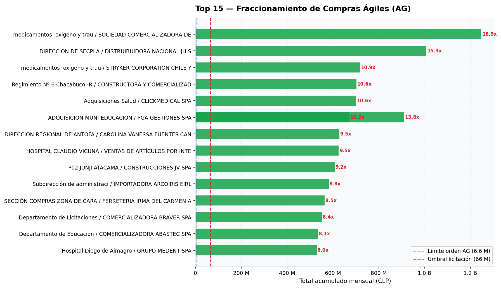
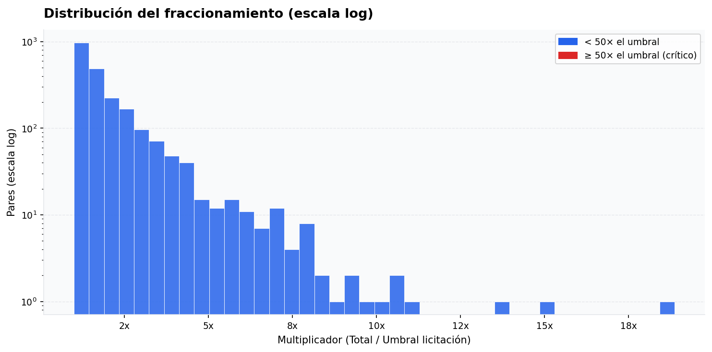
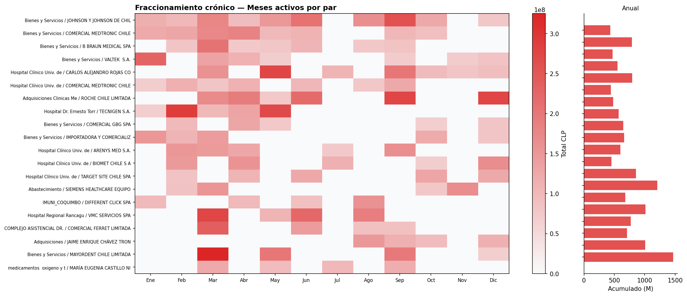
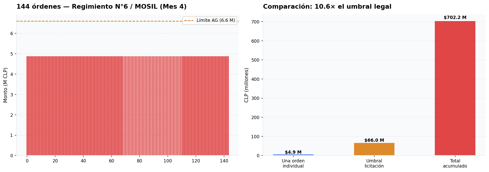
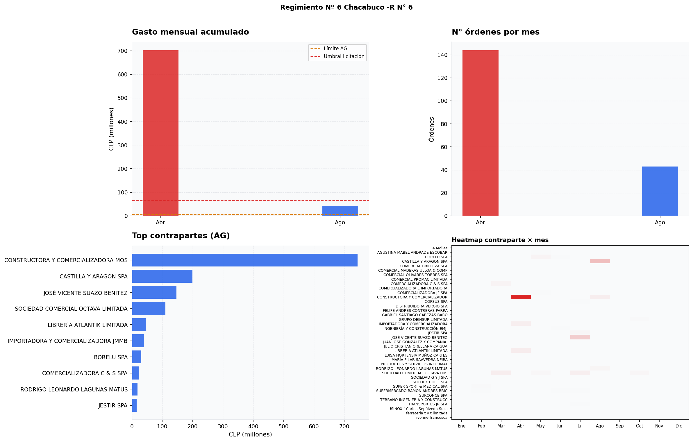

# Argos — Detección de Fraccionamiento Ilegal en Compras Públicas

**Análisis forense de 1.7 millones de transacciones del Estado chileno · 2025**

> ChileCompra reconoce que "el monitoreo automatizado de la fragmentación es una necesidad no resuelta del sistema" (Navarrete, 2024). Este proyecto lo construye.

---

## ¿Qué es el fraccionamiento y por qué importa?

Cuando el Estado necesita comprar algo, la ley establece que **si el monto supera 1.000 UTM (~$66M CLP), debe licitar públicamente** — varios proveedores compiten y el Estado elige la mejor oferta. Esto protege el dinero de todos.

La **Compra Ágil** es un mecanismo de excepción: permite compras rápidas sin licitación, pero solo si la orden individual no supera 100 UTM (~$6.6M CLP).

El **fraccionamiento** ocurre cuando un organismo divide deliberadamente una compra grande en muchas órdenes pequeñas para mantenerse bajo el umbral y evitar la licitación. Es **ilegal** conforme al DS 250 art. 13 y DS 661 art. 16, y puede resultar en multas de 10 a 100 UTM además de responsabilidad administrativa.

```
Licitación pública (lo que debería ocurrir)       Fraccionamiento (lo que detectamos)
─────────────────────────────────────────         ──────────────────────────────────────
  Compra de $702M en ferretería                     Orden 001: $4.87M  ← bajo el límite
         ↓                                          Orden 002: $4.87M  ← bajo el límite
  Llamado público a propuestas                      Orden 003: $4.87M  ← bajo el límite
         ↓                                          ...
  Varios proveedores compiten                        Orden 144: $4.87M  ← bajo el límite
         ↓                                                      ↓
  Se elige la mejor oferta                          Total: $702M → debía licitarse
```

---

## Hallazgo principal

El 10 de abril de 2025, el **Regimiento N°6 Chacabuco** emitió **144 órdenes de compra idénticas** en un solo día a **CONSTRUCTORA Y COMERCIALIZADORA MOSIL LIMITADA**:

| | |
|---|---|
| Monto por orden | $4,876,550 CLP — exactamente igual en las 144 |
| Total acumulado | **$702,223,200 CLP** |
| Supera el umbral de licitación | **10.6 veces** |
| Cotización de origen | `3365-52-COT25` — una sola invitación dividida en 144 ítems |
| Descripción | Adquisición de elementos de ferretería |
| Porcentaje del límite AG elegido | 73.9% — deliberadamente bajo el umbral de control |

Las 144 órdenes tienen el mismo monto exacto al peso, la misma fecha, la misma cotización de origen y la misma descripción. No es un error administrativo.

### Escala del problema

| Métrica | Valor |
|---------|-------|
| Casos de fraccionamiento detectados | **2,214** |
| Monto total expuesto | **$291.7 B CLP** |
| Sectores afectados | Salud, Educación, Ejército, Carabineros, Municipios |
| Par más crónico | Hospital Clínico U. de Chile → proveedor individual, **7 meses del año**, $1.01B CLP |

---

## Visualizaciones

**Top 15 casos por monto total expuesto:**



**Distribución de montos acumulados:**



**Pares crónicos — organismos que fraccionan 6+ meses del año:**



**Caso Regimiento Chacabuco — MOSIL (144 órdenes idénticas):**



**Drilldown de órdenes individuales:**



---

## Por qué grafos y no SQL

Los datos de compras son inherentemente relacionales. SQL puede responder "¿cuánto gastó este organismo?" pero no "¿qué proveedores comparten los mismos hospitales de forma sistemática?" ni "¿cuáles son los nodos con mayor poder estructural en toda la red?"

```
(UnidadCompra) ──EMITIO──> (OrdenCompra_Item) ──ADJUDICADA_A──> (Proveedor)
                                   └──CLASIFICA_COMO──> (Producto)

1,976 organismos · 49,020 proveedores · 1,649,920 transacciones
```

El grafo permite además ejecutar **PageRank** sobre la red — midiendo no solo quién vende más sino quién tiene poder estructural, independiente del volumen de ventas.

---

## Stack

| Componente | Tecnología |
|-----------|-----------|
| Fuente de datos | Mercado Público Chile (Azure Blob Storage) |
| ETL | Python · pandas |
| Almacenamiento | Neo4j 5 (Property Graph) |
| Algoritmos de grafos | Neo4j GDS (PageRank, proyecciones) |
| Análisis y visualización | Python · pandas · matplotlib |

### Pipeline

```
00_download_bronze.py    descarga CSVs desde Mercado Público
01_process_silver.py     limpieza y normalización
02_bulk_ingestion.py     carga en Neo4j vía APOC batch
03_create_projection.py  proyección GDS
04_run_analytics.py      PageRank + detección de patrones
```

---

## Clasificación de casos

Cada caso se evalúa en tres dimensiones independientes (1–3 puntos cada una):

| Dimensión | 1 punto | 2 puntos | 3 puntos |
|-----------|---------|---------|---------|
| **Evidencia forense** | Montos/descripciones variados | >80% en uno de los dos criterios | >80% en ambos o cotización única |
| **Cronicidad** | 1–2 meses | 3–5 meses | 6+ meses del año |
| **Escala** | <10x el umbral | 10–50x | >50x |

`CRÍTICO` ≥7 pts · `ALTO` ≥6 · `MEDIO` ≥4 · `BAJO` <4

La cronicidad tiene peso propio: un organismo que fracciona el mismo contrato en 7 meses distintos no puede argumentar que no sabía que el total superaría el umbral de licitación. Esto sigue el criterio del dictamen CGR sobre la Municipalidad de La Cisterna.

---

## Instalación

**Requisitos:** Python 3.11+, Neo4j 5 con APOC y GDS, Docker

```bash
git clone https://github.com/daraletdev/WatchTower-Chile
cd WatchTower-Chile
uv sync
cp .env.example .env          # configurar NEO4J_ROOT_PASSWORD
docker compose up -d
uv run python scripts/00_download_bronze.py
uv run python scripts/01_process_silver.py
uv run python scripts/02_bulk_ingestion.py
uv run python scripts/03_create_projection.py
uv run python scripts/04_run_analytics.py
cd notebooks && jupyter lab
```

---

## Marco legal

- DS 250 art. 13 — define y prohíbe la fragmentación
- DS 661 art. 16 (diciembre 2024) — nuevo reglamento, refuerza la prohibición
- Dictamen CGR, Municipalidad de La Cisterna — precedente sobre imprevisibilidad del monto
- Navarrete Millón, M. (2024). *Fragmentación en compras públicas*. ISBN 978-956-405-179-6
- Sanciones: 10 a 100 UTM + responsabilidad administrativa

---

## Advertencia metodológica

Los hallazgos son indicios estadísticos basados en patrones objetivos de datos públicos. No constituyen prueba de fraude ni determinación legal. Cada caso requiere verificación documental independiente.

---

*Datos: Mercado Público Chile 2025 · Licencia: MIT*
